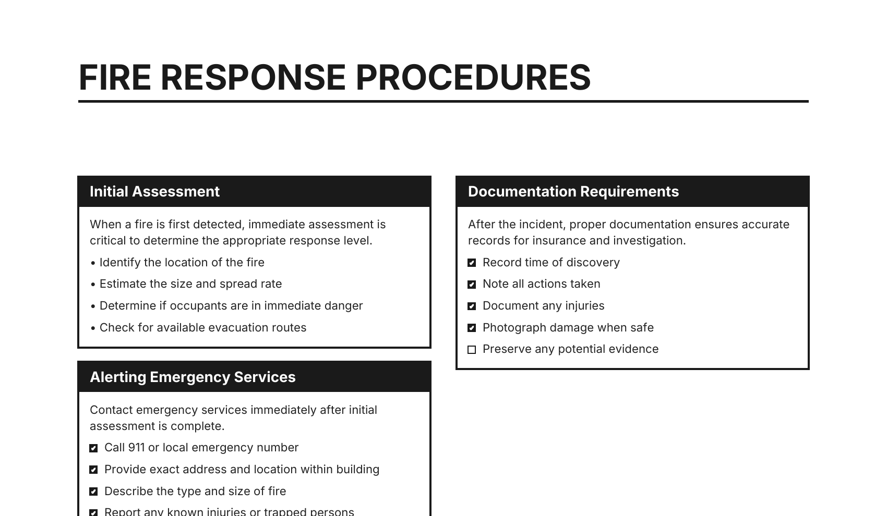

# Checklist PDF Generator

Generates PDF cheatsheets / checklists from markdown documents. Primarily intended for incident response checklists, runbooks, and reference cards. Sections are laid out in a two-column grid with bold headers, body text, bullet points, and checkboxes.



## Usage

```
uv run checklistpdf.py <input.md> [output.pdf]
```

The output file name is optional. If omitted, the output file will use the input file's name with a `.pdf` extension.

Example:

```
uv run checklistpdf.py samples/sample_fire_response.md
```

## Markdown Format

| Syntax | Result |
|--------|--------|
| `# Title` | Page title (H1) |
| `## Section` | Section header (H2) |
| `- item` | Bullet point |
| `- [ ] item` | Checkbox |
| `**bold**` | Bold text |
| Plain text | Body paragraph |

Each `# Title` starts a new page. Sections defined by `## Header` are arranged in a two-column grid.
